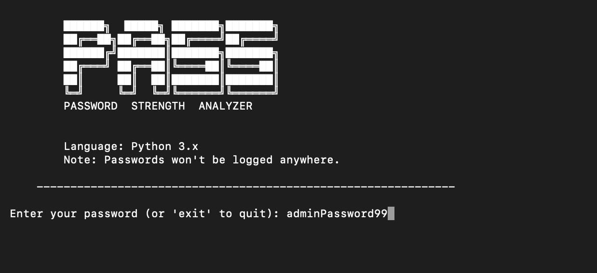

# 🔐 Password Strength Analyzer

This project is a simple Python terminal application that analyzes
the strength of a user-provided password.



## 🚀 Features
- Password length check
- Uppercase / lowercase letter check
- Number check
- Special character check
- Result: Weak / Medium / Strong / Insane

## 🛠 Technologies Used
- Python 3
- Terminal (CLI)

## ▶️ How to Run
```bash
python analyzer.py
```

## Contributing

Feel free to fork the repository and submit pull requests if you'd like to contribute.

---

## Contact

If you have any questions or suggestions, feel free to reach out:  
[GitHub Profile](https://github.com/egeturediCode)

---
